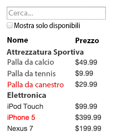
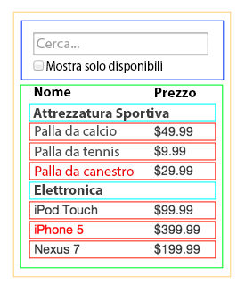

React è, secondo noi, il miglior modo per sviluppare applicazioni web complesse e performanti in JavaScript. Ha [scalato](https://it.wikipedia.org/wiki/Scalabilit%C3%A0) molto bene per noi in Facebook ed Instagram.

Una delle caratteristiche migliori di React è il modo in cui ti permette di pensare alle applicazioni mentre le sviluppi. In questo documento, ti guideremo nel processo di costruzione di una tabella di prodotti con funzionalità di ricerca usando React.

## Comincia Con Una Bozza {#start-with-a-mock}

Immaginiamo di avere già a disposizione una API JSON e che il nostro designer ci abbia fornito una bozza come questa:



La nostra API JSON ritorna dati in questa forma:

```
[
  {categoria: "Attrezzatura Sportiva", prezzo: "$49.99", disponibile: true, nome: "Palla da calcio"},
  {categoria: "Attrezzatura Sportiva", prezzo: "$9.99", disponibile: true, nome: "Palla da tennis"},
  {categoria: "Attrezzatura Sportiva", prezzo: "$29.99", disponibile: false, nome: "Palla da canestro"},
  {categoria: "Elettronica", prezzo: "$99.99", disponibile: true, nome: "iPod Touch"},
  {categoria: "Elettronica", prezzo: "$399.99", disponibile: false, nome: "iPhone 5"},
  {categoria: "Elettronica", prezzo: "$199.99", disponibile: true, nome: "Nexus 7"}
];
```

## Passo 1: Scomponi La UI In Una Gerarchia Di Componenti {#step-1-break-the-ui-into-a-component-hierarchy}

La prima cosa da fare è disegnare rettangoli attorno ad ogni componente (e sotto-componente) presente nella bozza e di dare un nome ad ognuno di essi. Se stai lavorando con un designer, probabilmente qualche passo in questa direzione è stato già fatto, consultatevi! I nomi dei livelli in Photoshop usati dai designers potrebbero dare nome anche ai tuoi componenti React!

Ma come fare a sapere cosa deve essere un componente a se stante? Usa le stesse tecniche che usi per decidere se devi creare una nuova funzione od un oggetto. Una di queste tecniche è il [principio di singola responsabilità](https://it.wikipedia.org/wiki/Principio_di_singola_responsabilit%C3%A0), che dice che un componente dovrebbe idealmente occuparsi di una cosa soltanto. Nel caso in cui un componente diventi troppo grande e complesso, dovrebbe essere decomposto in sotto-componenti più piccoli e semplici.

Dato che ti ritroverai spesso a dover presentare all'utente dei modelli dati JSON, noterai che se tali modelli sono stati definiti correttamente, la tua UI (e di conseguenza la struttura della gerarchia dei tuoi componenti) corrisponderanno. Ciò avviene perché entrambe tendono ad aderire alla stessa *architettura dell'informazione*. Separa la tua UI in componenti, dove ognuno di essi corrisponde ad una parte del modello dati.



Abbiamo identificato cinque componenti nella nostra applicazione. In corsivo, la parte del modello dati rappresentata da ogni componente. I numeri nell'immagine corrispondono ai numeri di seguito.

  1. **`TabellaProdottiRicercabile` (arancione):** contiene l'intero esempio
  2. **`BarraRicerca` (blu):** riceve tutti gli *input dell'utente*
  3. **`TabellaProdotti` (verde):** visualizza e filtra la *lista dei prodotti* a seconda dell'*input dell'utente*
  4. **`RigaCategoriaProdotti` (turchese):** visualizza una testata per ogni *categoria*
  5. **`RigaProdotto` (rosso):** visualizza una riga per ogni *prodotto*

Se dai un'occhiata a `TabellaProdotti`, noterai che la testata della tabella (contenente le etichette "Nome" e "Prezzo") non rappresenta un componente a se stante. Si tratta di una questione soggettiva, e ci sono argomenti validi in entrambi i sensi. In questo esempio, l'abbiamo lasciata come parte di `TabellaProdotti` perché fa parte della renderizzazione della *lista dei prodotti* che è una responsabilità di `TabellaProdotti`. Comunque, qualora questa testata dovesse diventare complessa (per esempio se volessimo aggiungere la gestione dell'ordinamento per colonna), avrebbe sicuramente senso creare un suo proprio componente `TestataTabellaProdotti`.

Adesso che abbiamo identificato i componenti nella nostra bozza, ordiniamoli gerarchicamente. I componenti che appaiono all'interno di un altro componente nella bozza, devono essere loro figli nella gerarchia:

  * `TabellaProdottiRicercabile`
    * `BarraRicerca`
    * `TabellaProdotti`
      * `RigaCategoriaProdotti`
      * `RigaProdotto`

## Passo 2: Sviluppa Una Versione Statica in React {#step-2-build-a-static-version-in-react}

[Prova su CodeSandbox](embedded-codesandbox://thinking-in-react/1?view=split&editorsize=70)

Adesso che hai la gerarchia dei componenti, è ora di implementare la tua applicazione. Il modo più facile è quello di sviluppare una versione che riceve dati dal modello e renderizza la UI senza alcuna interattività. È bene mantenere separati questi processi perché implementare una versione statica richiede la scrittura di molto codice non complesso, aggiungere interattività, al contrario, richiede di spremersi le meningi e la scrittura di poco codice. Vediamo perché.

Per costruire una versione statica della tua applicazione che renderizza il tuo modello dati, devi implementare componenti che riutilizzano altri componenti e passano dati usando *props*. Le *props* sono un modo di passare dati da genitore a figlio. Se sei familiare con il concetto di *state*, **evita di utilizzarlo del tutto** nella costruzione di una versione statica. Lo stato (nella forma della proprietà `state`) è riservato all'interattività, ovvero, dati che cambiano nel tempo. Dato che si tratta di una versione statica, non ne abbiamo bisogno.

Puoi cominciare partendo dall'alto (top-down) o dal basso (bottom-up). Il che significa che puoi cominciare con l'implementazione dei componenti più un alto nella gerarchia (per esempio cominciando da `TabellaProdottiRicercabile`) o con quelli più in basso al suo interno (`RigaProdotto`). Nei casi più semplici, è meglio preferire l'approccio top-down, nei progetti più grandi, è più facile l'approccio bottom-up e la contestuale scrittura di test man mano che si implementa.

<<<<<<< HEAD
Alla fine di questo passo, avrai una libreria di componenti riutilizzabili che renderizza il tuo modello dati. I componenti avranno solo metodi `render()` dati che è una versione statica dell'applicazione. Il componente al vertice della gerarchia (`TabellaProdottiRicercabile`) riceverà il tuo modello dati come prop. Qualora tu cambiassi il modello dati sottostante, richiamando `ReactDOM.render()` di nuovo, la UI verrà aggiornata. Vedrai come la UI si aggiorna al fine di individuare i necessari cambiamenti dato che quanto sta accadendo non è per nulla complicato. Il **flusso dati monodirezionale** di React (noto anche come *one-way binding*) mantiene ogni cosa modulare e veloce.
=======
At the end of this step, you'll have a library of reusable components that render your data model. The components will only have `render()` methods since this is a static version of your app. The component at the top of the hierarchy (`FilterableProductTable`) will take your data model as a prop. If you make a change to your underlying data model and call `root.render()` again, the UI will be updated. You can see how your UI is updated and where to make changes. React's **one-way data flow** (also called *one-way binding*) keeps everything modular and fast.
>>>>>>> 26a870e1c6e232062b760d37620d85802750e985

Fai riferimento alla [Documentazione](/docs/getting-started.html) se hai bisogno di aiuto nell'esecuzione di questo passo.

### Un Breve Intervallo: Props vs State {#a-brief-interlude-props-vs-state}

Esistono due tipi di "modello" dati in React: props e state. È importante capire la distinzione tra le due cose; sfoglia [la documentazione ufficiale di React](/docs/state-and-lifecycle.html) nel caso avessi dubbi.
Puoi leggere inoltre [FAQ: What is the difference between state and props?](/docs/faq-state.html#what-is-the-difference-between-state-and-props)

## Passo 3: Identifica la Minima (ma completa) Rappresentazione dello Stato della UI {#step-3-identify-the-minimal-but-complete-representation-of-ui-state}

Per rendere la tua UI interattiva, devi fare in modo che sia possibile alterare il modello dati sottostante. React rende ciò possibile grazie all'uso di **state**.

Al fine di implementare l'applicazione correttamente, devi innanzitutto pensare alla minima parte di stato mutabile del quale la tua applicazione ha bisogno. La chiave qui è [DRY: *Don't Repeat Yourself*](https://it.wikipedia.org/wiki/Don%27t_repeat_yourself). Individua la minima rappresentazione di stato richiesta dall'applicazione e calcola tutto il resto al bisogno. Ad esempio, se stai costruendo una "Lista delle cose da fare"; mantieni solo l'array degli elementi della lista; non mantenere una variabile separata nello stato per il conteggio, utilizza semplicemente la proprietà `length` dell'array.

Pensa a tutte le parti di dati nell'applicazione d'esempio. Abbiamo:

  * La lista originale dei prodotti
  * Il testo di ricerca inserito dall'utente
  * Il valore della checkbox
  * La lista filtrata dei prodotti

Vediamoli uno alla volta al fine di individuare quali rappresentano stato. Poniti tre domande per ognuno:

  1. Viene ricevuto da un genitore via props? In tal caso, probabilmente non si tratta di stato.
  2. Rimane invariato nel tempo? Se si, probabilmente non si tratta di stato.
  3. Puoi derivarlo in base ad altre parti di state o props nel tuo componente? Se è così, non è stato.

La lista originale dei prodotti viene ricevuta come props, non si tratta quindi di stato. Il testo di ricerca e la checkbox sembrano far parte dello stato dato che cambiano nel tempo e non possono essere derivati da nulla. Infine, la lista filtrata dei prodotti non fa parte dello stato visto che piò essere derivata dalla lista originale dei prodotti, dal testo di ricerca e dal valore della checkbox.

Infine, quindi, il nostro stato è:

  * Il testo di ricerca inserito dall'utente
  * Il valore della checkbox

## Passo 4: Identifica Dove Posizionare Il tuo Stato {#step-4-identify-where-your-state-should-live}

[Prova su CodeSandbox](embedded-codesandbox://thinking-in-react/2?view=split&editorsize=70)

OK, abbiamo individuato la minima rappresentazione di stato dell'applicazione. Adesso, dobbiamo trovare quale componente muta, o *possiede*, questo stato.

Ricorda: React è del tutto basato sul concetto di flusso dati unidirezionale dall'alto verso il basso nella gerarchia dei componenti. Può non risultare immediatamente chiaro quale componente deve mantenere quale parte di stato. **Questa è la parte più complicata da capire per chi è agli inizi,** segui questi passi come linea guida:

Per ogni parte di stato nella tua applicazione:

  * Identifica ogni componente che renderizza qualcosa in base a quello stato.
  * Identifica un componente proprietario comune (un singolo componente al di sopra di tutti i componenti che richiedono quello stato nella gerarchia).
  * Lo stato dovrà risiedere nel proprietario comune oppure in un altro componente più in alto nella gerarchia.
  * Se non riesci ad individuare facilmente il componente che sensatamente dovrebbe mantenere lo stato, crea un nuovo componente per fare ciò e posizionalo da qualche parte nella gerarchia al di sopra del componente proprietario comune.

Applichiamo questa strategia nella nostra applicazione:

  * `TabellaProdotti` ha bisogno di filtrare la lista dei prodotti in base allo stato e `BarraRicerca` deve visualizzare il testo di ricerca e lo stato della checkbox.
  * Il componente proprietario comune è `TabellaProdottiRicercabile`.
  * Concettualmente possiamo dire che ha senso mantenere il testo di ricerca e lo stato della checkbox all'interno di `TabellaProdottiRicercabile`

Bene, abbiamo deciso che il nostro stato vive in `TabellaProdottiRicercabile`. Prima di tutto, aggiungi una proprietà d'istanza `this.state = {testoRicerca: '', soloDisponibili: false}` nel `constructor` di `TabellaProdottiRicercabile`  al fine di riflettere lo stato iniziale della tua applicazione. Poi, passa `testoRicerca` e `soloDisponibili` a `TabellaProdotti` e `BarraRicerca` come prop. Infine, usa queste props per filtrare le righe in `TabellaProdotti` e impostare i valori nel form in `BarraRicerca`.

Puoi cominciare a vedere come si comporta l'applicazione: imposta `testoRicerca` a `"Palla"` e aggiornala. Vedrai che la tabella dati è stata aggiornata correttamente.

## Passo 5: Invertire il Flusso Dati {#step-5-add-inverse-data-flow}

[Prova su CodeSandbox](embedded-codesandbox://thinking-in-react/3?view=split&editorsize=70)

Fino ad ora, abbiamo implementato una applicazione che renderizza correttamente con props e state che fluiscono in basso nella gerarchia. Adesso è il momento di supportare il flusso inverso: dobbiamo fare in modo che i componenti form più in basso nella gerarchia, possano aggiornare lo stato in `TabellaProdottiRicercabile`.

React rende questo flusso dati esplicito in modo da facilitare la comprensione del funzionamento del programma, tuttavia richiede la scrittura di un po' più codice rispetto ad altre soluzioni con flusso dati bidirezionale (*two-way data binding*).

Se provi a scrivere qualcosa o a selezionare la casella nella precedente versione (passo 4), noterai che React ignora completamente il tuo input. Si tratta di un fatto intenzionale, abbiamo infatti impostato la prop `value` dell'`input` per essere sempre uguale allo `state` che riceve da da `TabellaProdottiRicercabile`.

Proviamo a pensare a cosa vogliamo far sì che avvenga. Vogliamo fare in modo che a seconda di come l'utente alteri il form, lo stato verrà alterato di conseguenza. Dato che i componenti possono alterare solamente il proprio stato, `TabellaProdottiRicercabile` passerà [callbacks](https://it.wikipedia.org/wiki/Callback) a `BarraRicerca` che verranno invocate ogni qual volta lo stato deve essere aggiornato. Possiamo utilizzare l'evento `onChange` degli input per ricevere tale notifica. Le callbacks passate da `TabellaProdottiRicercabile` chiameranno `setState()` facendo sì che la applicazione venga aggiornata.

## È Tutto {#and-thats-it}

Speriamo che adesso tu abbia un'idea su come pensare all'implementazione di componenti ed applicazioni in React. Anche se può sembrare che tu abbia bisogno di scrivere più codice di quanto tu sia abituato/a, ricorda che tale codice viene molto più letto che scritto, ed è meno difficile da comprendere grazie alla modularità e al fatto che è molto esplicito negli intenti. Non appena comincerai a costruire grandi librerie di componenti, apprezzerai queste caratteristiche ancor di più, inoltre, grazie al riutilizzo del codice, alla fine ti ritroverai a scrivere meno righe di codice. :)
